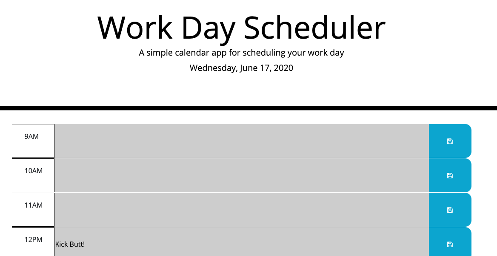
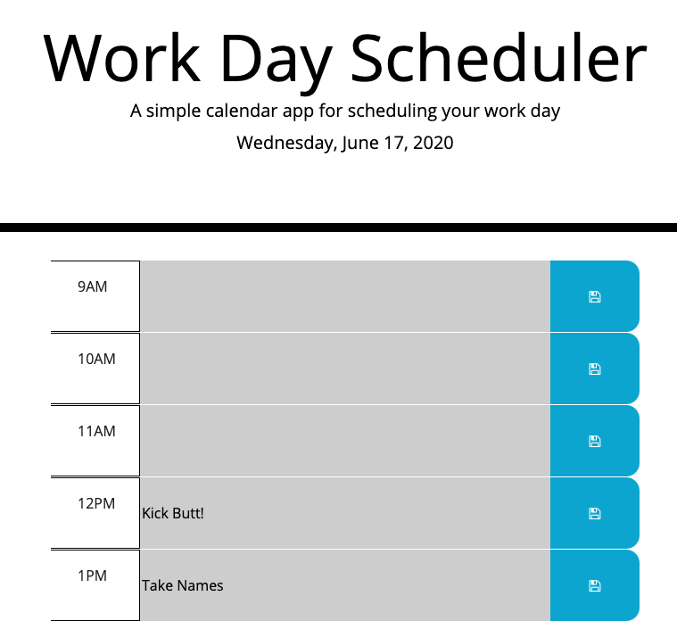
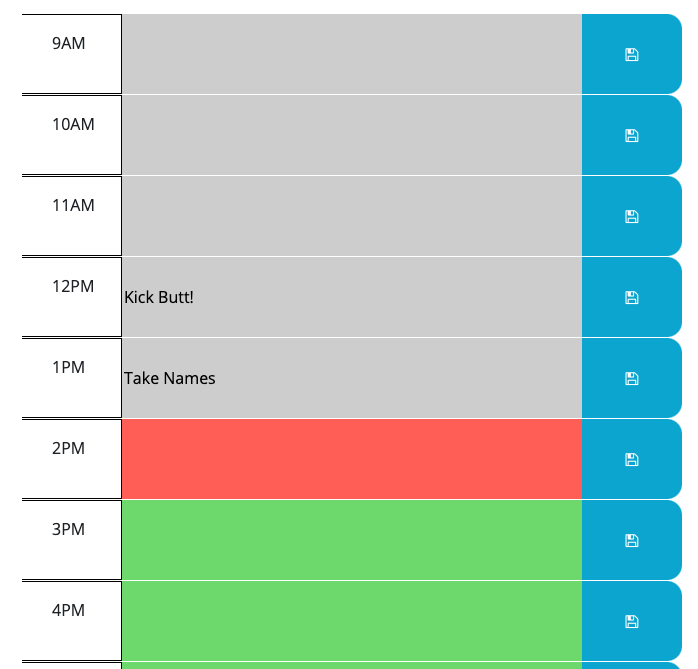

# Workday Scheduler

## Description

> This is a helpful workday planning tool for the everyday employee. The planner will retain items listed in the time slots and highlight the sections of the planner based on the hour of the day. 

## Deployment

> Open in the browser.

## Features

> The scheduler will store items in the local storage of the browser when the save button is clicked. The background color of the item is based on if the time slot is current, past, or upcoming. The top of the page displays the date.

## Images

